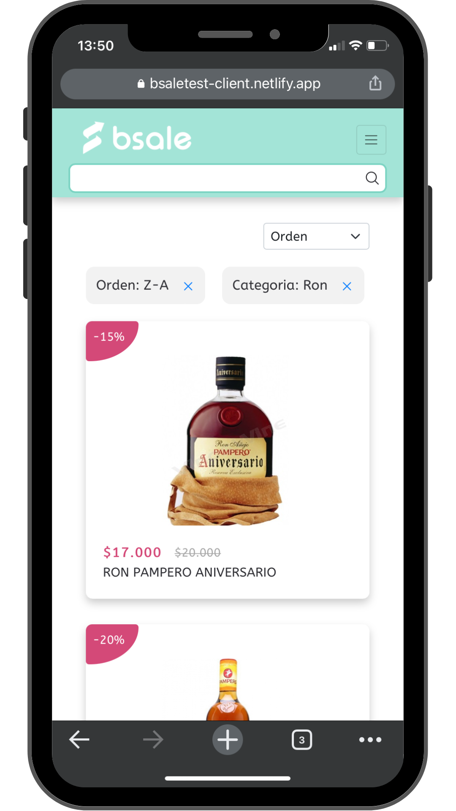
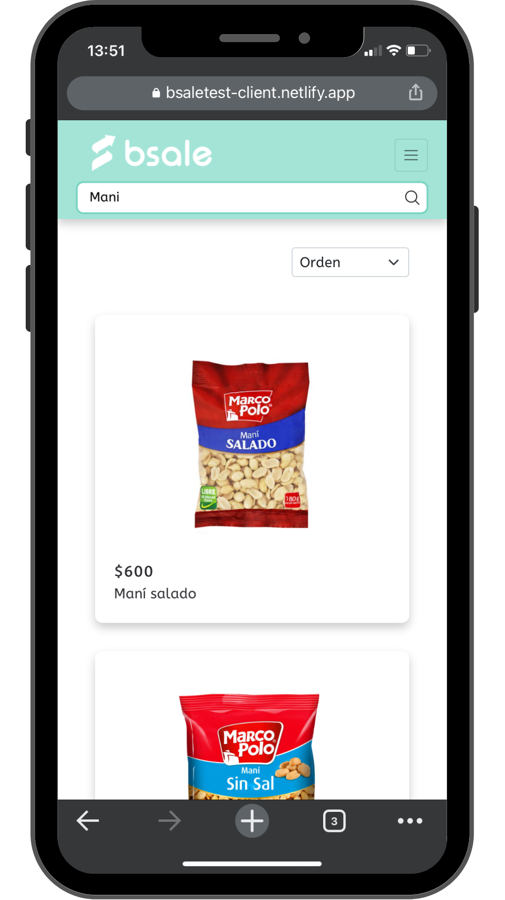
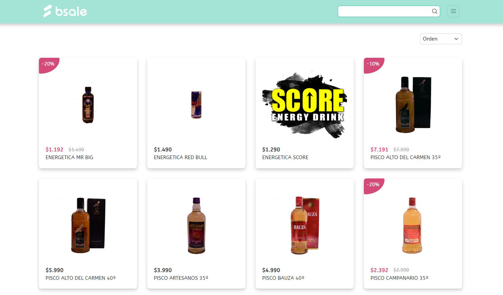
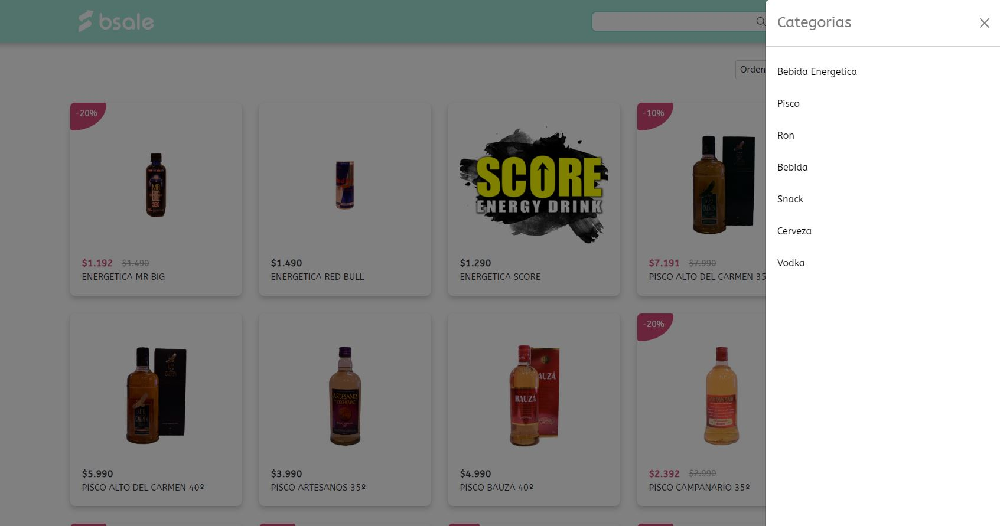
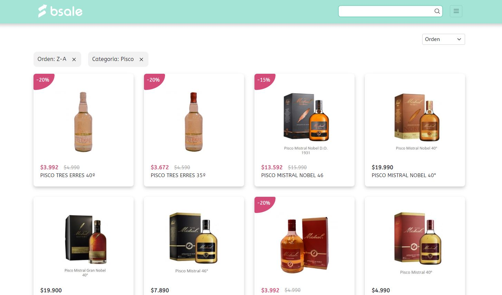
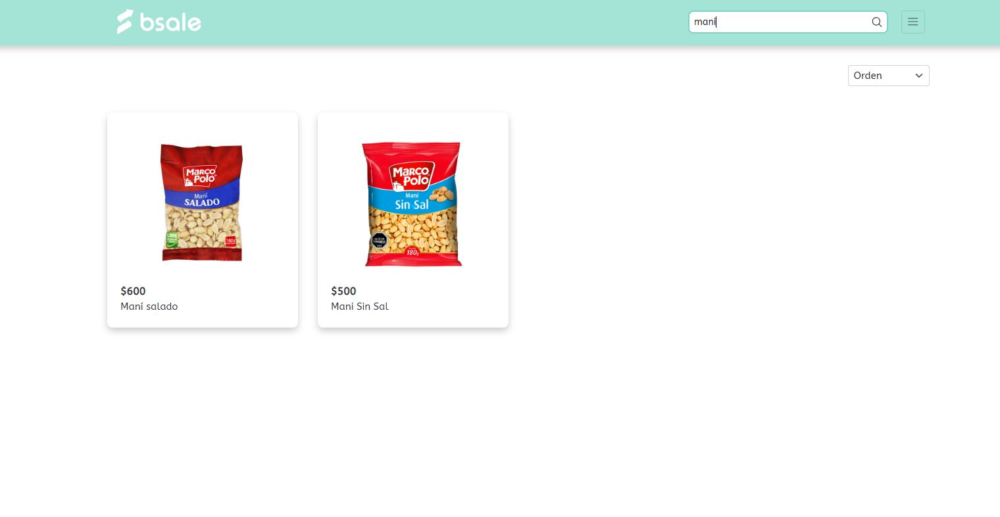

# Bsale Store

An online store developed as a single-page application with vanilla JavaScript that obtains data from the [Bsale Store API](https://api-bsaletest.herokuapp.com/api/products)

## Built With

|           |          |
| :-------- | :------- |
| 
 | HTML
 |
| 
 | CSS
 |
| 
 | JavaScript
 |
| 
 | Bootstrap
 |
|           |          |

## Features

- List all products by clicking the logo button
- Display the sidebar and filter products by selecting a category
- Search products (case-insensitive)
- Order products by ascending or descending

## Demo

### Responsive Design

Developed with a responsive design to work properly on different devices (cell phones, tablets, desktops and laptops).

- Mobile mode

  
  
- List of products

  

- Products filtered by category

  

- Products ordered and filtered by category

  

- Product search

  
 

